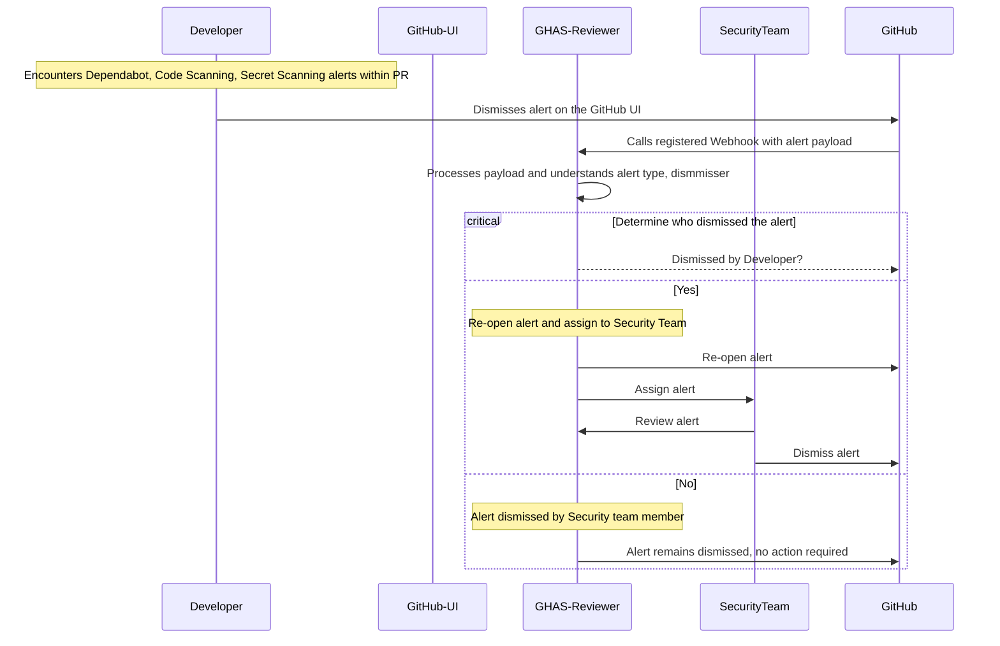

## captures how the GHAS-Reviewer app will work when alerts are dismissed by Developers on the GitHub UI

## The process flow is as follows:

1. The Developer dismisses the alert on the GitHub UI
2. A webhook is triggered and sends a payload to the GHAS-Reviewer app
3. The GHAS-Reviewer app receives the payload and processes it
4. If the alert dismissed is a dependabot, code scanning or secret scanning alert, the GHAS-Reviewer app will check if the alert is dismissed by the Developer
5. If the alert is dismissed by the Developer, the GHAS-Reviewer app will re-open the alert on the GitHub UI, and assign it to a member of the Security team
6. The Security team member will review the alert and take necessary actions, such as dismissing the alert, or creating an issue to fix the vulnerability

## Sequence Diagram

